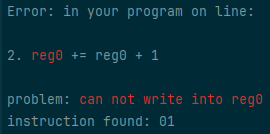
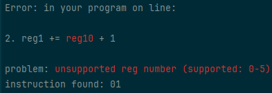

# Sopt lang & assembler

This is unofficial implementation of assembler for sopt lang.

Sopt lang is custom language made for the [FIKS competition](https://fiks.fit.cvut.cz/).

# Examples

So what can you do with this tool?

After you write code:
```
NOP
reg1 += reg0 + 1
if (reg0 == reg0) pc -= 2
```
_(all possible instruction formats can be found [here](input.example))_

you can generate byte code:

```
69 00 00 00 ; NOP
01 10 00 01 ; reg1 += reg0 + 1
11 00 00 02 ; if (reg0 == reg0) pc -= 2
```

## Error reporting examples



